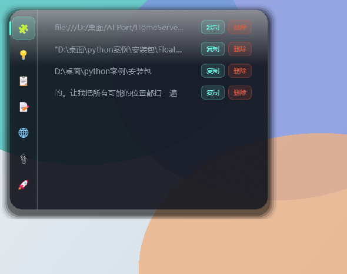

# FloatPulse · 生活悬浮球


**一款 Windows 桌面常驻悬浮球工具：剪贴板自动留存 → 素材临时中转 → 截图钉屏对照，手边的零碎一个球接住。**  
原生 PyQt6 控件 + QSS 实现，无 Electron、无浏览器内核；下载包 31 MB（解压后 75 MB），启动约 1 秒。

| 主窗口（深色） | 主窗口（浅色） |
| ------- | ------- |
| 主窗口     | 主窗口     |

---

## 🔍 与同类工具的区别

启动器负责找东西，截图工具负责看东西，FloatPulse 负责**你复制过、拖过、截下来那些东西的临时落脚点**——一个 IP、一个文件路径、一张刚截的图、一段待会儿还要用的命令。它们大多活不过半小时，但在那半小时里你得随时能找回来看一眼，而不是再去翻聊天记录或重新截一次。

它不打算做你的第二大脑。碎片进来是什么样，出去还是什么样；能带走的是你主动挑出来存成笔记、丢进知识库、或导出进 Obsidian 的那些。

| 能力           | FloatPulse              | FocusCapture | Floatyball | Flow Launcher  | Snipaste |
| ------------ | ----------------------- | ------------ | ---------- | -------------- | -------- |
| 悬浮球常驻入口      | ✅                       | ✅            | ✅          | ❌              | ❌        |
| 随手记录碎片       | ✅ 剪贴板自动收（为主）+ 快捕条 + 拖拽  | ✅ 剪贴板        | ⚠️ 拖放      | ❌              | ❌        |
| 碎片分类管理       | ✅ 来源 + 内容语义双轴           | ❌ 仅时间流       | ❌          | ❌              | ❌        |
| 碎片转笔记 / 入知识库 | ✅ 一键存为笔记、加入知识库          | ❌            | ❌          | ❌              | ❌        |
| 碎片转任务        | ❌ 手动无入口（AI 文本工坊可自动提取待办） | ❌            | ❌          | ❌              | ❌        |
| 临时素材中转       | ✅ 去重 + 缩略图 + 过期清理       | ❌            | ❌          | ❌              | ❌        |
| 截图钉屏         | ✅ 含批注与撤销                | ❌            | ❌          | ❌              | ✅        |
| 软件 / 网址启动    | ✅ 拖 exe 即建              | ❌            | ✅ AHK 动作   | ✅              | ❌        |
| AI 总结 / 对话   | ✅ 可选，本地 + 云端双后端         | ❌            | ❌          | ❌              | ❌        |
| 全局文件搜索       | ❌                       | ❌            | ❌          | ✅ 含 Everything | ❌        |
| 插件生态         | ⚠️ 外置插件 5 个，按需下载不预装     | ❌            | ✅ AHK      | ✅ 200+ 社区插件    | ❌        |
| 技术栈          | Python + PyQt6          | C# / WPF     | AutoHotkey | C# / .NET      | 闭源       |
| GitHub Stars | 1                       | 0            | 19         | 15,693         | 闭源       |

**表里的 ❌ 不是缺陷，是取舍。** 全局文件搜索交给 Everything 和 Flow Launcher——它们在索引速度与搜索语法上做得更好，再做一个没有意义；插件生态刚起步，目前是 5 个外置插件 + 插件商店 + 打包器，社区插件的数量不跟任何人比，写 ⚠️ 就是 ⚠️。项目 Stars 是 1 也照实写 1：这是个还在自用打磨阶段的项目，没有外部用户验证，不装成「已被广泛使用」。

**它不适合下面这些期待**——提前说清楚，省得装完才发现不是想要的：

| 如果你想要           | 实际情况                                   |
| --------------- | -------------------------------------- |
| 全局文件搜索          | ❌ 交给 Everything / Flow Launcher，它们做得更好 |
| 多端同步 / 手机也能看    | ❌ 本机单用户，没有服务端，也不会有                     |
| 替代你的笔记软件        | ❌ 它只是中转站，长文写作请交给 Obsidian / Notion     |
| 开箱即用的 AI        | ❌ AI 是外置插件的可选能力，不配 key、不开本地服务就完全不联网    |
| macOS / Linux 版 | ❌ Windows 10/11 only，且 UI 目前只有中文       |

*Stars 数据取自 GitHub API（仓库：`lch319/Floatyball`、`pengjie1115/FocusCapture`、`Flow-Launcher/Flow.Launcher`），2026-10-01 快照，之后会变化。完整竞品实测数据、赛道分析与「站不住的说法」清单属内部调研资料，未随仓库公开，需要可开 Issue 索取。*

---

## ✨ 功能特性

### 🎈 悬浮球（高频轻量入口）

- 可拖拽、四向吸边隐藏、鼠标移近自动滑出
- 悬停弹出 440×340 快捷卡片，滚轮翻卡、点击换卡
- 拖文件到球 → 自动收入碎片池；拖入 `.exe/.lnk` → 生成软件启动器
- 全局热键快速捕捉条（`Ctrl+Alt+K`）：不打断当前工作随手记
- **截图钉屏（`Ctrl+Alt+S`）**：框选屏幕任意区域，钉成置顶参考浮窗；滚轮缩放内容（光标锚定）、右下角抓手等比例调整窗框、批注（画笔/箭头/马赛克，Ctrl+Z 撤销）、右键复制/保存



### 🃏 快捷卡片（三模式）

| 模式      | 行为                               |
| ------- | -------------------------------- |
| 📚 知识卡片 | 随机抽取知识库段落供速查，悬停自动关闭              |
| 📋 日程任务 | 输入区 + 任务列表 + 截止日期分组（逾期/今天/本周/以后） |
| 📝 随时笔记 | 单条便签，800ms 防抖自动保存                |

### 🤖 AI 助手（可选能力，本地 / 云端双后端）

- **主窗口专属页面**（第一个页面插件）：`Ctrl+Alt+I` 或侧栏「🤖 AI 助手」进入，一键「总结任务 / 整理碎片 / 本周小结」读应用内数据，也可自由问答；输入框 **Enter 直发、Shift+Enter 换行**
- **三种后端一套配置**：统一走 OpenAI 兼容协议——① 云端填 DeepSeek / 硅基流动地址与 key；② 纯本地接 Ollama（`127.0.0.1:11434`）；③ **自带本地推理**：浏览选择 llama-server.exe 与 .gguf 模型，点「启动」由插件拉起服务（默认端口 8093，显卡全量卸载，退出程序自动结束、不占残留显存），本地模式**断网可用**、数据不出机
- **保存并测试连接**：后端设置一键落盘 + 探活，状态行即时反馈 ✓ / ✗ 与失败原因（401 / 404 / 超时各有针对性提示）
- **核心功能保持离线**：AI 是外置插件的**可选能力**，插件必须在 manifest 声明 `capabilities: ["network"]` 才能联网，且只能经宿主网络桥发请求（插件自身拿不到网络库）；插件中心卡片显示「🌐 网络访问」标记，所有请求只记 URL 与耗时进 `app.log` 可审计
- **AI 总配置（云端 / 本地只配一次）**：设置页「🧠 AI 总配置」里配好后端，勾选授权哪些 AI 插件接入——接入的插件直接用这套地址与 Key（改完即生效，无需重启），未接入的插件回落各自私有配置；本地推理由宿主统一拉起 llama-server（默认端口 8095），一处启动、所有接入插件共用
- 不装 key、不开本地服务时，程序其余功能与旧版完全一致

### 🖥 主窗口（十个页面，侧栏按四组折叠）

侧栏分「**工作台 / 工具 / 插件 / 系统**」四组，点组标题开合，**多组可同时展开**；展开集合会被记住，下次启动原样恢复。窗口装不下时侧栏出现滚动条，按钮尺寸恒定不再被压扁。

| 分组  | 页面                                                                                                                                                                                                                    |
| --- | --------------------------------------------------------------------------------------------------------------------------------------------------------------------------------------------------------------------- |
| 工作台 | 🧩 碎片工作台（剪贴板文本/路径/文件/知识段落**自动收纳**，来源 + 内容语义双轴筛选、搜索、合并、一键存为笔记 / 加入知识库 / 导出 Obsidian）· 📋 日程任务（逾期红标、相对截止时间、撤销条、🍅 专注计时）· 📝 笔记管理（列表 + 编辑区 + 自动保存）· 📚 知识库（docx 数据源，段落增删改、外部修改检测、增量同步）· 📎 临时素材（拖拽拾取、缩略图、sha256 去重、过期清理） |
| 工具  | 🌐 网址导航（收藏网址一键打开）· 🚀 软件导航（本地快捷方式、图标提取、一键启动）                                                                                                                                                                          |
| 插件  | 全部页面插件，**按需安装**（见下节）                                                                                                                                                                                                  |
| 系统  | 🔌 插件中心（安装 / 启停 / 卸载 / 商店）· ⚙️ 设置 · ❓ 使用说明                                                                                                                                                                            |

### 🛡 工程化细节

- 三层架构（UI / 业务 / 数据）严格解耦，模块化拆分
- JSON 原子写入（临时文件 + `os.replace`）、损坏自动回退
- Windows 互斥量单实例防护、全局异常钩子、多屏/分辨率漂移容错
- 深浅双主题（QSS 模板 + 颜色字典），对比度有测试护栏
- pytest 测试套件 + 离屏 GUI 验证脚本

---

## 🔌 插件：按需下载安装

**主程序包里不含任何插件。** 你可能只想用其中一个，没必要为一两个功能下载全部；所以插件走独立下载，想要哪个装哪个。不装插件不影响任何核心功能——悬浮球、碎片、任务、笔记、知识库、素材、截图钉屏、软件/网址导航全部照常可用。

**三步装好：**

1. 在下表点链接直接下载想要的 `.fpplug`（每个只有 10–40 KB；也可到 [Releases](https://github.com/2026heshao/FloatPulse/releases) 页面的 Assets 区手动挑选）
2. 把它放进程序目录下的 **`plugin_store\`** 文件夹（不解压、不改名）
3. 启动程序 → 插件中心 → 「🏪 插件商店」→ 点「安装」，装完即生效，无需重启

**更省事：应用内在线市场。** 插件商店弹窗里有「🌐 检查在线市场」按钮——点一下自动拉取官方插件索引、列出本地还没装的插件，点「⬇ 下载安装」即可（下载经 sha256 校验后落商店目录，再走同一条安装链路）。只在点击那一刻访问 GitHub API，不点不联网，离线时本地安装完全不受影响。

| 插件包                                                                                                                  | 页面 / 热键                 | 能力         | 说明                                                           |
| -------------------------------------------------------------------------------------------------------------------- | ----------------------- | ---------- | ------------------------------------------------------------ |
| [ai-assistant.fpplug](https://github.com/2026heshao/FloatPulse/releases/latest/download/ai-assistant.fpplug)         | 🤖 AI 助手 / `Ctrl+Alt+I` | 🌐 ✍ 🛠 🧠 | 本地 / 云端双后端的对话助手：读应用内任务、碎片、笔记做总结、分类与问答，可用本机 llama-server 全程离线 |
| [ai-text-workshop.fpplug](https://github.com/2026heshao/FloatPulse/releases/latest/download/ai-text-workshop.fpplug) | ✂ 文本工坊 / `Ctrl+Alt+T`   | 🌐 ✍ 🧠    | 剪贴板一键 AI 加工：润色成邮件、翻译、总结要点、提取待办并转任务                           |
| [kb-search.fpplug](https://github.com/2026heshao/FloatPulse/releases/latest/download/kb-search.fpplug)               | 🔍 站内搜索 / `Ctrl+Alt+F`  | 只读         | 五类数据全文检索：自研中文分词 + 倒排索引 + BM25，`Ctrl+K` 也由它承接                 |
| [recurring-tasks.fpplug](https://github.com/2026heshao/FloatPulse/releases/latest/download/recurring-tasks.fpplug)   | 🔁 周期任务 / `Ctrl+Alt+R`  | ✍          | 只给规则（每天/每周几/每月几号/每 N 天），到点自动生成任务                             |
| [weekly-report.fpplug](https://github.com/2026heshao/FloatPulse/releases/latest/download/weekly-report.fpplug)       | 周报草稿 / `Ctrl+Alt+W`     | 只读         | 汇总区间内已完成任务、碎片与番茄次数，生成 Markdown 草稿                            |

> 能力标记的含义：🌐 会经宿主联网（只记 URL 与耗时进日志）· ✍ 能新增数据 · 🛠 能改删数据（删除带撤销令牌）· 🧠 可接入设置页的「AI 总配置」共用一套后端。插件本身拿不到网络库，未声明的能力调用会被直接拒绝。

**卸载与重装**：插件中心的「🗑 卸载」只删 `plugins\` 里那份副本，`plugin_store\` 里的源包保留——想再装回来，回商店点一次「安装」即可。插件的私有数据（`float_data\plugins\<插件id>\`）卸载时不会被删除（安装版该目录位于 `%APPDATA%\FloatPulse`，同样不随卸载删除）。

**自己做插件**：依赖只允许 PyQt6 + Python 标准库，打成 `.fpplug` 用 `python tools/pack_plugin.py plugins/<插件目录>` 即可分发安装。完整开发说明（插件契约、能力声明、知识库接口）属内部资料，需要可开 Issue 索取。

---

## 🚀 快速开始

### 方式一：双击启动器（推荐）

双击项目根目录的 **`启动v4.bat`**：

| 命令               | 行为                   |
| ---------------- | -------------------- |
| `启动v4.bat`       | 启动 v4（开发主线），带控制台实时日志 |
| `启动v4.bat quiet` | 后台启动，无控制台窗口（日常使用）    |

> v2 / v3 冻结基线已于 2026-09-27 清理移除，当前只保留 v4 主线；历史版本可从 GitHub 提交记录中查看。

启动器会自动探测已安装 PyQt6 的 Python 并自检依赖。

### 方式二：命令行

```bash
pip install -r requirements.txt
cd v4
python knowledge_ball.py
```

依赖：`PyQt6==6.7.1`、`python-docx==1.1.2`（见 `requirements.txt`）

### 默认热键

| 热键           | 功能                            |
| ------------ | ----------------------------- |
| `Ctrl+Alt+K` | 快速捕捉条（随手记碎片）                  |
| `Ctrl+Alt+S` | 截图钉屏（框选区域置顶参考，支持批注）           |
| `Ctrl+K`     | 站内搜索（由 `kb-search` 插件提供，需先安装） |
| `Esc`        | 关闭卡片 / 取消截图                   |

---

## 📦 打包分发

采用 PyInstaller **onedir** 模式（启动快、误报低）：

```bash
pip install pyinstaller
python -m PyInstaller --noconfirm --clean --distpath dist2 --workpath build2 FloatPulse.spec
```

产物 `dist2\FloatPulse\` 整个文件夹拷走即可运行，目标电脑无需 Python。

**发布包用脚本组装，不要手工压缩**（`tools/build_release.py`，纯标准库）：

```bash
python tools/build_release.py --dry-run            # 先体检：看会进包什么、被排除什么
python tools/build_release.py                      # 产出 宣传页/FloatPulse-v<版本>-win64.zip
```

它做四件手工压缩容易漏的事：

- **白名单式收集**（只认 `FloatPulse.exe` 与 `_internal/`），把开发机上跑出来的个人数据挡在包外——`data/*.json`（碎片/笔记/任务）、`app.log`、`temp_assets/`（剪贴板截图等）一律不进包，`float_data/` 里也只认 `知识库.docx` 且**默认连它也不打**（`--with-knowledge` 才打），避免把个人知识库发出去
- **不预装任何插件**：包内是空的 `plugins\` 与 `plugin_store\` 目录 + 一份《插件安装说明.txt》；校验发现包里出现 `.fpplug` 或 `plugins/<子目录>` 会直接删掉输出报错
- 打完**重新打开 zip 自校验**（缺 exe / 缺目录 / 夹带数据都算失败，不留坏包），输出体积与 SHA-256
- 顺带把 `plugin_store/*.fpplug` 复制到 `宣传页/plugin-assets/` 并生成 `插件清单.md`——这些就是 Release 上**逐个上传的插件附件**

**Release 工程三件套**（推送 `v*` tag 后 `.github/workflows/release.yml` 自动完成）：

- **安装包进 CI**：CI 用 choco 装 Inno Setup，`build_release.py --installer` 编译出 `FloatPulse-v<版本>-setup.exe`，与 zip、`.fpplug` 一并上传——Release 页从此可直接下载安装包
- **发布前三源一致性自检**：打包前先跑 `tools/check_release_consistency.py`，核对 `APP_VERSION` ↔ `CHANGELOG.md` 版本标题 ↔ Release tag 三者对齐，任一不符直接终止发布（本地也能手动跑）
- **产物附 `SHA256SUMS.txt`**：`build_release.py` 收尾生成校验清单（覆盖 zip / setup.exe / 插件附件），下载后在 `宣传页/` 目录 `sha256sum -c SHA256SUMS.txt` 一键核验完整性

体积口径：**下载包 31 MB**（v4.7.0 zip，2026-09-30 实测）／**解压后 75 MB**（2026-09-27 实测，`FloatPulse.spec` 内有构成分析）；恢复 ssl 支持插件联网桥后约 +4 MB，下次打包时以 `build_release.py` 输出为准。

---

## 🗂 目录结构

```
FloatPulse/
├── v4/                # 【开发主线】源码、测试与离屏验证脚本
├── plugins/           # 外置插件源码（一包一目录；发布包里此目录为空，插件按需下载）
├── assets/images/     # README 截图
├── tools/             # 工程脚本（打包插件 / 组装发布包 / 发布前自检）
├── shared/            # 图标 / 打包 spec / 包内《插件安装说明.txt》
└── 启动v4.bat          # 启动器
```

未列出的 `dist2/`（打包产物）与 `宣传页/`（发布 zip 与插件附件）都不进版本库——前者可随时重建，后者走 GitHub Release 附件。

运行数据统一收纳在 `float_data/`（含 `temp_assets/` 与 `知识库.docx`），路径定位见 `v4/src/app_paths.py`，按发布形态**双轨**解析：**zip 便携版**数据留在 exe 同目录（解压即用，随目录移动）；**安装版**（setup.exe）数据走 `%APPDATA%\FloatPulse\float_data\`，与安装目录解耦——升级 / 重装换目录数据不跟随丢失，卸载也不会删除。安装版首次启动若检测到旧位置（程序目录内）有历史数据，会弹窗询问并自动迁移，原数据保留备份（改名 `float_data.migrated-<时间戳>`）。开发仓库内该目录已在 `.gitignore` 中，不会入库。

---

## 🧱 架构一览

```
UI 层    FloatingBall / CardWindow / MainWindow / 十个页面（索引 0–9）
业务层   TaskManager / NoteManager / FragmentManager / DocxManager
         ClipboardMonitor / TempAssetManager / ConfigManager / Hotkey
数据层   docx + 8 个 JSON（原子写入 / 损坏回退 / 增量指纹）
```

开发与测试约定见 `CONTRIBUTING.md`；核心测试：

```bash
cd v4
python -m pytest tests/ -q     # 逻辑层 + 护栏测试
python test_init.py            # 启动冒烟
```

---

## 🗺 Roadmap

- [x] v4：截图钉屏、开源运营包
- [x] Obsidian Markdown 导出（笔记 / 碎片 / 任务 → vault，只读、幂等）
- [x] 外置插件系统：能力声明（network / write / manage / ai）、页面插件、商店、打包器
- [x] 侧栏按四组折叠（多组可同时展开 + 过渡动效 + 溢出滚动）
- [x] 插件按需分发：主程序包不预装，Release 逐包下载
- [ ] `/` 命令面板（搜索即入口）

---

## 🤝 贡献

Issue / PR 均欢迎，见 [CONTRIBUTING.md](CONTRIBUTING.md)。  
提交前请跑一遍测试套件；UI 改动请附离屏截图（`tools/run_gui_check.py`）。

## 📄 License

[MIT](LICENSE) © 2026 FloatPulse Contributors

---

## English


**FloatPulse** is a Windows floating-ball utility built with native PyQt6 — a lightweight, Electron-free landing spot for everything you copy, drag or capture, always one hover away.

- **Floating ball**: drag, edge-snap, hover to pop a quick card; drop files to capture; drop `.exe/.lnk` to create launchers
- **Clipboard capture (the main path)**: text and paths you copy are kept automatically, de-duplicated and timestamped; plus a global hotkey (`Ctrl+Alt+K`) note bar and drag-and-drop pickup
- **Screenshot pin** (`Ctrl+Alt+S`): select any screen region and pin it as an always-on-top reference window
- **Main window**: ten pages in a four-group collapsible sidebar (multiple groups can stay open), fragments workbench, tasks with deadline grouping, notes, docx-based knowledge base, asset manager, URL & app launcher
- **Plugins, opt-in**: the app ships **without any plugins** — download the `.fpplug` you want from Release Assets, drop it into `plugin_store\`, and install it from the plugin center (AI assistant, in-app full-text search, recurring tasks, weekly report)
- **Engineering**: layered architecture, atomic JSON writes, single-instance guard, dual theme with contrast tests, pytest suite

```bash
pip install -r requirements.txt
cd v4 && python knowledge_ball.py
```

Windows 10/11, Python 3.10+. Licensed under MIT. Chinese UI only (i18n welcome).

**Not for**: global file search (use Everything / Flow Launcher), cross-device sync, or replacing your notes app — it is a staging area, not a second brain.
