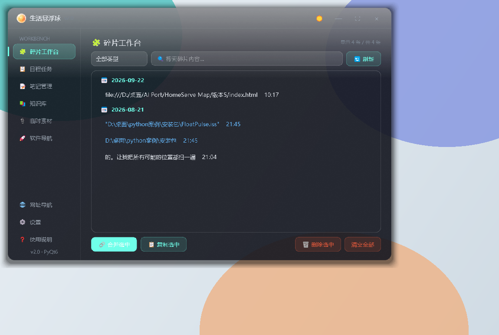

# FloatPulse · 生活悬浮球

[](LICENSE)
[](README.md)
[](requirements.txt)
[](requirements.txt)

**一款 Windows 桌面常驻悬浮球工具：碎片收集 → 任务/笔记 → 知识复习 → 截图钉屏，一个球全搞定。**
原生 PyQt6 控件 + QSS 实现，无 Electron、无浏览器内核，打包后 71 MB，启动 1–2 秒。

| 主窗口（深色） | 悬浮球 + 快捷卡片 |
|---|---|
|  |  |

---

## ✨ 功能特性

### 🎈 悬浮球（高频轻量入口）
- 可拖拽、四向吸边隐藏、鼠标移近自动滑出
- 悬停弹出 420×320 快捷卡片，滚轮翻卡、点击换卡
- 拖文件到球 → 自动收入碎片池；拖入 `.exe/.lnk` → 生成软件启动器
- 全局热键快速捕捉条（`Ctrl+Alt+K`）：不打断当前工作随手记
- **截图钉屏（`Ctrl+Alt+S`）**：框选屏幕任意区域，钉成置顶参考浮窗；滚轮缩放（0.15×–5×）、拖动、右键复制/保存

### 🃏 快捷卡片（三模式）
| 模式 | 行为 |
|------|------|
| 📚 知识卡片 | 随机翻牌复习，悬停自动关闭 |
| 📋 日程任务 | 输入区 + 任务列表 + 截止日期分组（逾期/今天/本周/以后） |
| 📝 随时笔记 | 单条便签，800ms 防抖自动保存 |

### 🖥 主窗口（九面板）
| 面板 | 功能 |
|------|------|
| 🧩 碎片工作台 | 剪贴板文本/路径/文件/知识段落统一收纳，搜索、筛选、合并、复制 |
| 📋 日程任务 | 逾期红标、相对截止时间、撤销条 |
| 📝 笔记管理 | 列表 + 编辑区 + 自动保存 |
| 📚 知识库 | docx 数据源，段落增删改、外部修改检测、增量同步 |
| 🗂 临时素材 | 文件/图片拖拽拾取、缩略图、sha256 去重、过期清理 |
| 🌐 网址导航 | 收藏网址一键打开 |
| 💻 软件导航 | 本地软件快捷方式、图标提取、一键启动 |
| 🔍 全局搜索 | `Ctrl+K` 跨面板搜索（懒创建） |
| ⚙️ 设置 | 主题 / 剪贴板 / 热键 / 悬浮球尺寸 / 开机自启 等 |

### 🛡 工程化细节
- 三层架构（UI / 业务 / 数据）严格解耦，模块化拆分
- JSON 原子写入（临时文件 + `os.replace`）、损坏自动回退
- Windows 互斥量单实例防护、全局异常钩子、多屏/分辨率漂移容错
- 深浅双主题（QSS 模板 + 颜色字典），对比度有测试护栏
- pytest 测试套件 + 离屏 GUI 验证脚本

---

## 🚀 快速开始

### 方式一：双击启动器（推荐）

双击项目根目录的 **`启动v4.bat`**：

| 命令 | 行为 |
|---|---|
| `启动v4.bat` | 启动 v4（开发主线），带控制台实时日志 |
| `启动v4.bat quiet` | 后台启动，无控制台窗口（日常使用） |
| `启动v4.bat v3` / `v2` | 启动冻结基线，用于行为对照 |

启动器会自动探测已安装 PyQt6 的 Python 并自检依赖。

### 方式二：命令行

```bash
pip install -r requirements.txt
cd v4
python knowledge_ball.py
```

依赖：`PyQt6==6.7.1`、`python-docx==1.1.2`（见 `requirements.txt`）

### 默认热键

| 热键 | 功能 |
|------|------|
| `Ctrl+Alt+K` | 快速捕捉条（随手记碎片） |
| `Ctrl+Alt+S` | 截图钉屏（框选区域置顶参考） |
| `Ctrl+K` | 全局搜索（主窗口内） |
| `Esc` | 关闭卡片 / 取消截图 |

---

## 📦 打包分发

采用 PyInstaller **onedir** 模式（启动快、误报低）：

```bash
pip install pyinstaller
python -m PyInstaller --noconfirm --clean --distpath dist2 --workpath build2 FloatPulse.spec
```

产物 `dist2\FloatPulse\` 整个文件夹拷走即可运行，目标电脑无需 Python。
注意：exe 需与 `知识库.docx` 同目录（知识卡片模式的数据源）。

---

## 🗂 目录结构

```
FloatPulse/
├── v4/                # 【开发主线】后续优化都在这里
├── v2/ v3/            # 冻结基线（只读对照）
├── shared/            # 图标 / 打包 spec / 工具脚本
├── data/              # 运行数据（config / fragments / notes / ... 自动生成）
├── docs/              # 文档与图片
├── 设计稿/             # UI 原型与验证截图
└── 启动v4.bat          # 启动器
```

各版本共用根目录的 `data/`、`temp_assets/`、`知识库.docx`，路径定位见 `src/app_paths.py`。

---

## 🧱 架构一览

```
UI 层    FloatingBall / CardWindow / MainWindow / 九个 Panel
业务层   TaskManager / NoteManager / FragmentManager / DocxManager
         ClipboardMonitor / TempAssetManager / ConfigManager / Hotkey
数据层   docx + 7 个 JSON（原子写入 / 损坏回退 / 增量指纹）
```

开发与测试约定见 `docs/` 下各主题文档；核心测试：

```bash
cd v4
python -m pytest tests/ -q     # 逻辑层 + 护栏测试
python test_init.py            # 启动冒烟
```

---

## 🗺 Roadmap

- [x] v4：截图钉屏、开源运营包
- [ ] 知识卡片间隔重复（Anki 式复习）
- [ ] `/` 命令面板（搜索即入口）
- [ ] Obsidian Markdown 导出

---

## 🤝 贡献

Issue / PR 均欢迎，见 [CONTRIBUTING.md](CONTRIBUTING.md)。
提交前请跑一遍测试套件；UI 改动请附离屏截图（`tools/run_gui_check.py`）。

## 📄 License

[MIT](LICENSE) © 2026 FloatPulse Contributors

---

## English

**FloatPulse** is a Windows floating-ball utility built with native PyQt6 — a lightweight, Electron-free "capture everything" hub living on your desktop edge.

- **Floating ball**: drag, edge-snap, hover to pop a quick card; drop files to capture; drop `.exe/.lnk` to create launchers
- **Quick capture**: global hotkey (`Ctrl+Alt+K`) note bar; clipboard text/image monitoring with dedup
- **Screenshot pin** (`Ctrl+Alt+S`): select any screen region and pin it as an always-on-top reference window
- **Main window**: fragments workbench, tasks with deadline grouping, notes, docx-based knowledge base, asset manager, URL & app launcher, global search
- **Engineering**: layered architecture, atomic JSON writes, single-instance guard, dual theme with contrast tests, pytest suite

```bash
pip install -r requirements.txt
cd v4 && python knowledge_ball.py
```

Windows 10/11, Python 3.10+. Licensed under MIT. Chinese UI only (i18n welcome).
