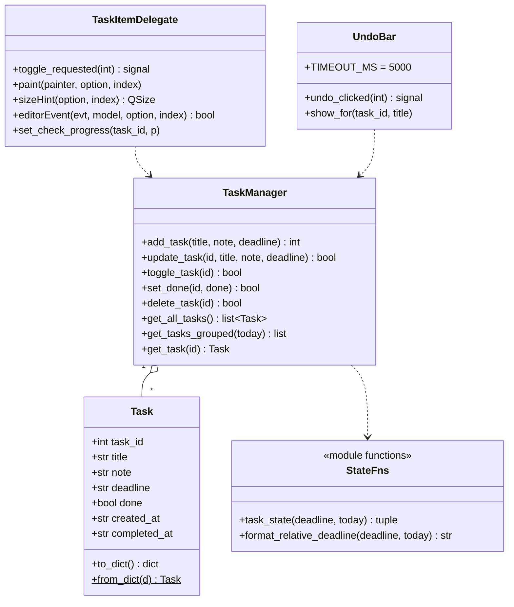

# 日程任务模块 · 实现方案与任务分解

> 架构师 高见远 ｜ 2026-09-23 ｜ 依据 v3 代码现状核查 + PM《体感与功能优化清单》
> 本轮范围：A1 / A2 / A3 / B1 / B3 / C1 / C3 + `completed_at`（7 项 + 1 数据层）

## 一、实现方案与关键设计决策

### ① 自定义行控件：`QStyledItemDelegate` 自绘（**不用** `setItemWidget`）
- **理由**：`setItemWidget` 会在每行插入真实 QWidget，**吃掉鼠标事件**——单击选中、Ctrl/Shift 多选、右键 `customContextMenuRequested`、原生键盘/滚轮行为都需手动转发，回归风险高（正是本模块既有强交互）。delegate 自绘**完全不改** QListWidget 的命中/选择/右键链路，`itemAt()`、`selectedItems()`、`ExtendedSelection` 全部照旧。
- 行数规模小（个人工具，数十条），无虚拟化压力；勾选框 + 标题 + 相对时间 + 状态色全部集中在 `paint()` 一处绘制，反而替代了当前"文本字符串拼接"的脆弱做法。
- 交互命中：`delegate.editorEvent()` 处理 `MouseButtonRelease`，用 `option.rect` 计算「勾选框矩形」与「标题矩形」，命中则 emit 自定义信号 `toggle_requested(task_id)`（`QStyledItemDelegate` 是 QObject，可直接定义 `pyqtSignal`）。右键 `editorEvent` 返回 `False` 让其继续冒泡 → 原生右键菜单不受影响。

### ② 勾选动画画在哪里：delegate `paint()` 内（**不另开 overlay**）
- 动画四要素全部在 `paint()` 按进度绘制：对勾 `QPainterPath` 按 progress 描绘、圆框按 `1.0→1.15→1.0` 缩放、标题删除线按 progress 从左划出、文字/整行色按 progress 插值到次级灰。
- 驱动：面板级**单个** `QVariantAnimation`（0→1），`valueChanged` → `self._task_list.viewport().update()`；进度存 `self._check_progress: dict[task_id -> float]`，delegate 以 **task_id 为键**读取（非 item 指针，故 `refresh()` 重建 item 不丢动画）。
- 不建 overlay widget：会引入绝对定位、与滚动同步、透明窗口合成的复杂度，收益低。
- **时长接入全局 `anim_speed`**：基准常量 `CHECK_ANIM_MS = 150`，实际时长 `max(1, int(CHECK_ANIM_MS / anim_speed))`。

### ③ 撤销提示条：新建复用组件 `UndoBar`，作为面板/卡片的**浮动子控件（overlay）**
- 列表内嵌 widget 会污染分组数据模型且与"再点勾选框取消"语义打架 → 不用；悬浮球 `_ToastLabel` 位于球体上方、不适用主窗口内部 → 不复用。
- 新建轻量 `UndoBar(QWidget)` 放 `src/controls.py`（既有共享控件模块），作为 `TasksPanel` / 卡片任务页的子控件：`raise_()` + 底部居中显示，`QTimer.singleShot(UNDO_BAR_MS=5000)` 自动隐藏；含「撤销」按钮，emit `undo_clicked(task_id)`。两处入口共用同一组件，避免重复实现。

### ④ 公共状态函数：放 `src/task_manager.py`（业务层，纯函数无 Qt 依赖）
```python
def task_state(deadline: str, today: str | None = None) -> tuple[str, int | None]:
    """返回 (state, days_delta)。
    state ∈ {"overdue","today","future","none"}
    days_delta = (deadline 日期 - today).days：逾期为负数(如 -3=逾期3天)、
    今天=0、未来>0；无日期/格式异常=None。"""
def format_relative_deadline(deadline: str, today: str | None = None) -> str:
    """UI 文案：今天 / 明天 / 逾期N天 / M月D日（周X）；无日期返回 ""。"""
```
- **口径决策（修 C3 的实质）**：deadline 解析统一用 `date.fromisoformat`，**解析失败即视为 `none`**。旧行为里主窗口用字符串比较会把脏日期判成"逾期"、角标/提醒却跳过——新口径四方（主窗口/小卡片/角标/托盘）都判为无日期、不计数、不标红，彻底对齐。
- 四处共用：`tasks_panel.refresh()`、`card_window._refresh_task_list()`、`knowledge_ball.refresh_badge()`、`knowledge_ball._check_task_reminders()` 全部改为调用 `task_state()`。

### ⑤ 分组：组标题行**混入同一 QListWidget**（不做独立分节控件）
- 重建时按组顺序依次 `addItem` 组标题 item（`flags` 去掉 `ItemIsSelectable`，`UserRole+1 = KIND_HEADER`）+ 该组任务行 item（`KIND_ROW`）。delegate `paint()` 按 `KIND_*` 分支绘制组标题（小号灰字 + 计数）或任务行。
- **与既有 `refresh()` 全量重建的关系**：`refresh()` 语义**不变**（仍 `clear()` + 全量重建），只是重建顺序改由新增的 `TaskManager.get_tasks_grouped()` 提供。改动面最小、与现有架构天然契合。
- 分组/排序逻辑**放业务层** `TaskManager.get_tasks_grouped()`（可单测），UI 只负责渲染。批量选择/右键需**跳过 header**（`UserRole` 非 int 即忽略）。

### ⑥ `completed_at` 的格式 / 写入时机 / 缺省
- **格式**：`"YYYY-MM-DD HH:MM"`，与 `created_at` 一致（`strftime("%Y-%m-%d %H:%M")`）。此处"时分"是**完成时间戳**的记录精度，与 B5「deadline 时分精度」（用户决策本轮不做）是两回事。
- **写入时机**：`set_done(task_id, done)` 中 `done=True` → 写当前时间；`done=False` → 清空 `""`。`toggle_task` 保留为兼容包装，内部翻转后同步维护 `completed_at`。
- **`from_dict` 缺省**：`completed_at=str(d.get("completed_at", ""))`（沿用现有防御风格），存量 JSON 无该键自动补空串，**无需迁移脚本**；`Task.__init__` 新参数给默认值 `""`，避免破坏既有构造调用点。

## 二、文件清单

| 文件 | 动作 | 一句话职责 |
|---|---|---|
| `v3/src/task_manager.py` | 改 | `Task.completed_at`、`set_done()`、`get_tasks_grouped()`、`task_state()`/`format_relative_deadline()` 公共函数 + 状态/分组常量（预留 `deadline_time` 注释位） |
| `v3/src/task_delegate.py` | **新增** | `TaskItemDelegate`：行/组标题绘制、勾选动画、命中判定与 `toggle_requested` 信号 |
| `v3/src/controls.py` | 改 | 新增 `UndoBar` 复用组件（undo 提示条） |
| `v3/src/constants.py` | 改 | 动画/时长常量：`CHECK_ANIM_MS`、`CHECK_BOUNCE_SCALE`、`UNDO_BAR_MS` |
| `v3/src/theme.py` | 改 | 两套主题新增状态色/token + `#taskList` delegate 适配 QSS + 组标题样式（`QSS` 集中管理） |
| `v3/src/tasks_panel.py` | 改 | 主窗口任务页：`QLineEdit`→`QDateEdit`、接入 delegate、行内 toggle、分组渲染、相对时间、UndoBar |
| `v3/src/card_window.py` | 改 | 小卡片任务页：接入 delegate、补状态色、分组、相对时间、行内 toggle、UndoBar；编辑弹窗保留 `QDateEdit` |
| `v3/knowledge_ball.py` | 改 | `refresh_badge()` / `_check_task_reminders()` 改用 `task_state()` |
| `v3/src/main_window.py` | 改 | 暴露 `anim_speed` 访问器（供面板缩放动画），透传 `anim_speed_changed` |
| `v3/tests/test_logic.py` | 改 | 新增 `task_state` / `get_tasks_grouped` / `completed_at` 单测（保持既有 32 项通过） |

## 三、数据结构与接口



- `Task`：新增字段 `completed_at: str`（默认 `""`），`to_dict/from_dict` 同步。
- `TaskManager.set_done(task_id: int, done: bool) -> bool`（幂等设值 + 维护 `completed_at`）。
- `TaskManager.get_tasks_grouped(today: str | None = None) -> list[tuple[str, list[Task]]]`：返回按
  `overdue→today→week→later→none→done` 顺序的 `(group_key, tasks)`，组内按 deadline 升序（无日期按 created_at 升序）。
- `task_state(deadline, today=None) -> (state: str, days_delta: int | None)`；`format_relative_deadline(deadline, today=None) -> str`。
- 模块常量：`STATE_OVERDUE/TODAY/FUTURE/NONE`、`GROUP_*` + 中文标题映射、`KIND_ROW/KIND_HEADER`。

## 四、调用流程（点击勾选框 → 数据变更 → 双视图 + 角标刷新）

```mermaid
sequenceDiagram
    participant U as 用户
    participant D as TaskItemDelegate
    participant P as TasksPanel / 卡片任务页
    participant TM as TaskManager
    participant B as knowledge_ball

    U->>D: 单击勾选框/标题
    D-->>P: toggle_requested(task_id)
    P->>TM: set_done(task_id, done=True)
    TM->>TM: done=True; completed_at=now; _save()
    TM-->>P: True
    P->>P: 启动勾选动画(progress[task_id]=0, 时长=CHECK_ANIM_MS/anim_speed)
    P->>P: refresh() 按 get_tasks_grouped() 全量重建
    P->>D: paint() 读 progress 绘对勾/删除线/降级灰
    P->>U: 显示 UndoBar「已完成「XX」撤销」(5s)
    P->>B: data_changed.emit("task")
    B->>TM: get_all_tasks()
    B->>B: task_state() 计数 → refresh_badge()
    U->>P: 5s 内点勾选框
    P->>TM: set_done(task_id, False)
    TM->>TM: done=False; completed_at=""
    P->>P: refresh() + 隐藏 UndoBar + 反向动画
```

## 五、任务列表（按依赖排序，5 个）

**T01 · 数据层与共享设施**（无依赖 · P0）
- 目标文件：`task_manager.py`、`constants.py`、`theme.py`、`tests/test_logic.py`
- 改什么：①`Task` 加 `completed_at`（默认""），`to_dict/from_dict` 同步；②新增 `set_done()`，`toggle_task()` 内部维护 `completed_at`；③新增 `get_tasks_grouped()`、`task_state()`、`format_relative_deadline()` 及状态/分组/`KIND_*` 常量；④`constants.py` 加 `CHECK_ANIM_MS=150`/`CHECK_BOUNCE_SCALE=1.15`/`UNDO_BAR_MS=5000`；⑤`theme.py` 两套主题新增状态色与撤销条 token；⑥`test_logic.py` 增补单测。
- 完成判据：`task_state` 对 `逾期/今天/未来/空/脏日期` 返回正确 `(state, delta)`；`get_tasks_grouped` 顺序与组内升序正确；旧 JSON（无 `completed_at`）能加载且补空串；既有 32 项 + 新增测试全绿。

**T02 · 自定义行渲染层**（依赖 T01 · P0）
- 目标文件：`task_delegate.py`（新建）、`theme.py`（QSS 适配）
- 改什么：实现 `TaskItemDelegate`（`paint/sizeHint/editorEvent` + `toggle_requested` 信号 + `set_check_progress`）；按 `KIND_HEADER/KIND_ROW` 分支绘制组标题、圆形勾选框、标题、相对时间、状态色；实现对勾描绘/回弹/删除线/整行降级的 progress 插值绘制；`editorEvent` 命中勾选框或标题矩形 → emit `toggle_requested`，右键返回 False。
- 完成判据：脱离业务可单测的 `sizeHint`/命中判定正确；勾选动画在 150ms（÷anim_speed）内完成；右键/多选行为不受影响。

**T03 · 主窗口任务页改造**（依赖 T01、T02 · P0）
- 目标文件：`tasks_panel.py`
- 改什么：①截止输入 `QLineEdit`→`QDateEdit`（`setCalendarPopup(True)`、`yyyy-MM-dd`，非法回退今天）；②列表接入 `TaskItemDelegate`，item 不再拼字符串、改设 `UserRole=task_id`；③连接 `toggle_requested` → `set_done` + 动画 + `refresh()` + `data_changed.emit("task")`；④`refresh()` 改用 `get_tasks_grouped()` 分段重建（header 不可选）；⑤`_on_context_menu`/`_get_selected_ids` 跳过 header；⑥接入 `UndoBar`（5s 撤销）；⑦动画时长读 `host` 的 `anim_speed`。
- 完成判据：单击勾选框/标题即完成并播放动画；5s 内可撤销；列表按分组排序；日期用日历选择；批量/右键/清除已完成正常。

**T04 · 小卡片任务页对齐**（依赖 T01、T02 · P0）
- 目标文件：`card_window.py`
- 改什么：任务列表接入同一 `TaskItemDelegate`；`_refresh_task_list()` 改用 `get_tasks_grouped()` + `task_state()` 补逾期红/今日橙；`_on_task_context_menu`/新增行内 toggle → `set_done`；接入 `UndoBar`；相对时间文案；标题/截止行维持；`_edit_task` 保留 `QDateEdit`。
- 完成判据：小卡片与大窗口勾选、配色、相对时间、分组表现一致；编辑弹窗正常。

**T05 · 状态口径统一 + 动画速度接入 + 集成回归**（依赖 T01、T03、T04 · P0）
- 目标文件：`knowledge_ball.py`、`main_window.py`、`theme.py`（如有微调）
- 改什么：①`refresh_badge()` 与 `_check_task_reminders()` 改用 `task_state()`（脏日期统一视为无日期）；②`main_window.py` 暴露 `anim_speed` 访问器并把 `anim_speed_changed` 透传给任务面板；③端到端连调：主窗口勾选 → 双视图 + 悬浮球角标 + 托盘口径一致；④跑 `tests/test_logic.py` 与 `test_init.py` 冒烟。
- 完成判据：同一份数据在列表/角标/托盘的逾期+今日计数完全一致；调节动画速度档位即时影响勾选动画；全部测试通过。

## 六、共享知识（跨文件约定）
- **状态枚举**：`STATE_OVERDUE="overdue"` / `STATE_TODAY="today"` / `STATE_FUTURE="future"` / `STATE_NONE="none"`（`task_manager.py`）。
- **分组键与标题**：`GROUP_OVERDUE="逾期"` / `GROUP_TODAY="今天"` / `GROUP_WEEK="本周"` / `GROUP_LATER="以后"` / `GROUP_NONE="无日期"` / `GROUP_DONE="已完成"`。
- **item 类型 role**：`Qt.ItemDataRole.UserRole = task_id`；`Qt.ItemDataRole.UserRole + 1 = KIND`（`KIND_ROW` / `KIND_HEADER`）。
- **动画常量**：`CHECK_ANIM_MS=150`、`CHECK_BOUNCE_SCALE=1.15`、`UNDO_BAR_MS=5000`（`constants.py`）；实际时长一律 `ms / anim_speed`。
- **主题 token 命名**：`task_overdue` / `task_today` / `task_done` / `task_none` / `task_check` / `undo_bg` / `undo_text`（两套主题都补齐；QSS 集中 `theme.py`，组件不写死颜色）。
- **组件放置**：共享控件 → `src/controls.py`；行渲染 → `src/task_delegate.py`。
- **保存/通知**：所有写操作走 `TaskManager` 内部 `_save()`；变更后 UI `emit data_changed("task")`。

## 七、风险与回归注意点
1. **自定义行控件 × 全量重建**：delegate 方案下 item 仍是普通 `QListWidgetItem`，`refresh()` `clear()` 重建安全；动画进度以 **task_id** 为键存活于面板，重建后照常绘制。**注意**：切换后任务会因分组移动到底部（已完成组），动画在"新位置"播放——符合预期，勿试图在旧位置停留。
2. **多选批量操作**：header item 必须 `flags` 去掉 `ItemIsSelectable`；`_get_selected_ids()` 与 `_on_batch_*` 需按 `UserRole` 是否为 int 过滤 header，否则批量删除会误伤 header（无 id）。
3. **右键菜单**：`delegate.editorEvent` 对右键必须返回 `False`；`_on_context_menu` 中 `itemAt(pos)` 命中 header 时应直接 return。
4. **滚动位置**：`refresh()` 全量重建仍会丢滚动位置（D3 本轮不做）——**已知项**，勾选后行会跳位；如体验不可接受再单开优化，不在本任务列表内。
5. **`completed_at` × `_load` 兼容**：旧 `schedule.json` 无该键 → `from_dict` 补 `""`；`Task.__init__` 新参默认值 `""` 保证既有构造调用点不炸；不产生静默数据丢失（沿用现有备份逻辑）。
6. **既有 32 项测试**：现无 `TaskManager` 用例，新增字段不影响既有断言；新增 `task_state`/`get_tasks_grouped` 用例为纯逻辑（无 Qt），不影响 GUI 冒烟。
7. **C3 口径变化（行为变更）**：脏日期从"列表标红/角标跳过"统一为"无日期"。需在提交说明中显式标注，避免被当成回归。
8. **`anim_speed` 可及性**：面板当前无该值通道，T05 需在 `MainWindow` 暴露访问器；在此之前 T03/T04 的动画时长先取默认 `1.0`。

## 八、待明确事项
1. **「本周」边界定义**：`today` 与 `tomorrow` 已有独立组，`GROUP_WEEK` 应指「后天 → 本周日」，还是「7 天内」？影响 `get_tasks_grouped` 分组逻辑，需产品确认。
2. **`anim_speed` 暴露方式**：优先 `MainWindow.anim_speed` 属性还是面板直接读 `host._config`？建议前者（保持面板不碰 config 实现）。
3. **撤销条与分组移动的叠加**：勾选后行已移入"已完成"组，UndoBar 仅作提示不定位到行——确认可接受。
